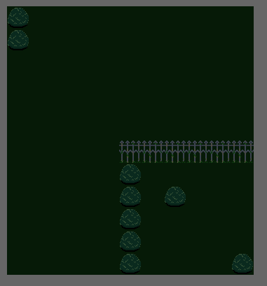

# bevy_ecs_ldtk
An ECS-friendly ldtk plugin for [bevy](https://github.com/bevyengine/bevy).
Uses [bevy_ecs_tilemap](https://github.com/StarArawn/bevy_ecs_tilemap) as a base.
Not released yet, still in development.

bevy_ecs_tilemap once supported ldtk loading, but this was removed to keep the plugin small and focused (see: https://github.com/StarArawn/bevy_ecs_tilemap/issues/84).

This plugin aims to be a more complete solution to ldtk in bevy, with the following goals.
- [x] Supports all layer types
  - [x] tile layers
    - rendered with bevy_ecs_tilemap
  - [x] auto tile layers
    - rendered with bevy_ecs_tilemap
  - [x] intgrid layers
    - intgrid values accessible as components on tiles
  - [x] entity layers
    - new entities spawned at the correct location for users to flesh out in their own systems
    - [x] fields accessible from components on new entities
- [x] support for external levels
- [ ] hot-reloading for ldtk and its dependencies
  - [x] hot-reloading for tile layers
  - [x] hot-reloading for auto tile layers
  - [x] hot-reloading for intgrid layers
  - [x] hot-reloading for entity layers
  - [x] hot-reloading for tilesets
  - [ ] hot-reloading for external levels (see: https://github.com/Trouv/bevy_ecs_ldtk/issues/1)
- [ ] derive macros for registering bundles to spawn for specific intgrid-layer and entity-layer values
- [ ] "transform" feature for automatically applying transforms to EntityInstances and IntGridCells
  - [ ] Options for updating transforms from TilePos, or the other way around
- [ ] support for optionally loading level-neighbors

Once most of these goals are met, and bevy has reached 0.6, this crate will have its first release.
